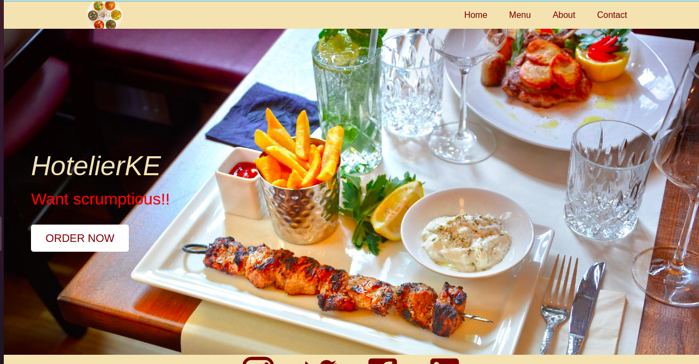
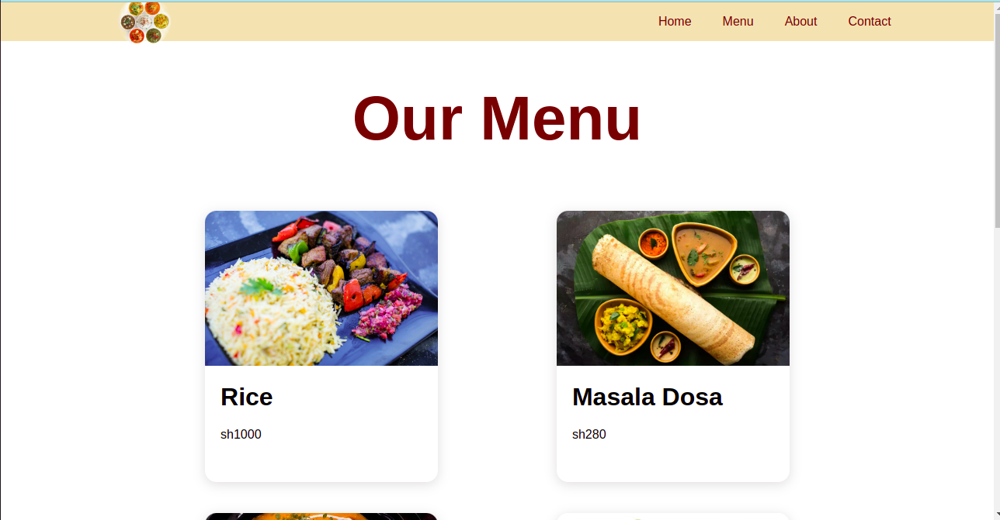
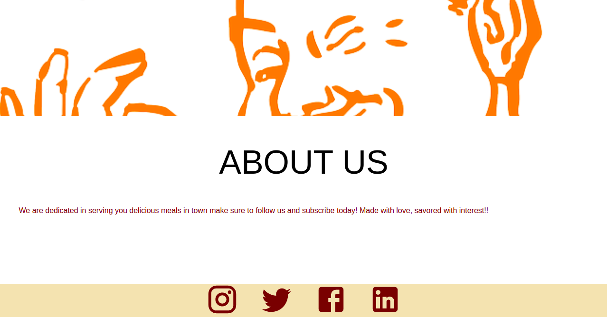
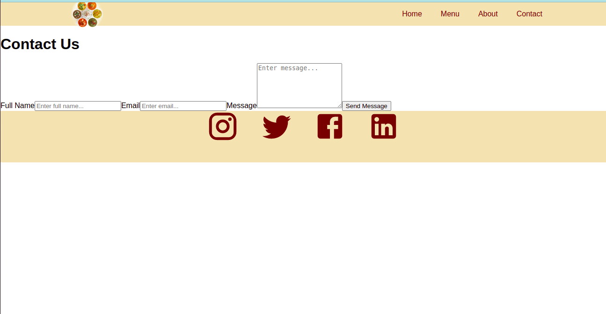

# _**HotelierKE**_
---
###  **BRIEF DESCRIPTION**
 Hotelier can be used by any hotel owner looking forward to market their services digitally and to get a world class reputation!!

`This is the landing page of my website`

---

`This is the menu page of my website`

---
`This is the about page of my website`

---
`This is the contacts page of my website`

---

### **CONTRIBUTORS**
Hotelier is a development by Salome Mabonga a software engineer.
### **DESCRIPTION**
This application is a great source of information that links both hotel owners and clients both locally and internationally.On the clients side, Hotelier is very useful as it can be used by both local and international tourist who love trying out delicious meals and visiting great hotels.This is a great application to showcase to the world all that you got, that is in the meals you offer.

# Getting Started with Create React App

This project was bootstrapped with [Create React App](https://github.com/facebook/create-react-app).

## Available Scripts

In the project directory, you can run:

### `npm start`

Runs the app in the development mode.\
Open [http://localhost:3000](http://localhost:3000) to view it in the browser.

The page will reload if you make edits.\
You will also see any lint errors in the console.

### `npm test`

Launches the test runner in the interactive watch mode.

### `npm run build`

Builds the app for production to the `build` folder.\
It correctly bundles React in production mode and optimizes the build for the best performance.

The build is minified and the filenames include the hashes.\
Your app is ready to be deployed!

### `npm run eject`

**Note: this is a one-way operation. Once you `eject`, you can’t go back!**

If you aren’t satisfied with the build tool and configuration choices, you can `eject` at any time. This command will remove the single build dependency from your project.

Instead, it will copy all the configuration files and the transitive dependencies (webpack, Babel, ESLint, etc) right into your project so you have full control over them. All of the commands except `eject` will still work, but they will point to the copied scripts so you can tweak them. At this point you’re on your own.

### **KNOWN BUGS**
The menu images tend to take time loading but its a WIP to be resolved soonest.
### **TECHNOLOGIES USED**
HTML

- The application is based upon Html that is used to create the basic structure of the web page.

CSS

- CSS this is used to style the html structure. 

JAVASCRIPT

- Javascript this is used to test the functionality of html and CSS.
### **SUPPORT AND CONTACT DETAILS**
Incase of any issues feel free to contact me at my email address at [sallynanjala254@gmail.com](sallynanjala254@gmail.com) you can also make your contributions.
### **License**
MIT License

Permission is hereby granted, free of charge, to any person obtaining a copy of this software and associated documentation files (the "Software"), to deal in the Software without restriction, including without limitation the rights to use, copy, modify, merge, publish, distribute, sublicense, and/or sell copies of the Software, and to permit persons to whom the Software is furnished to do so, subject to the following conditions:

The above copyright notice and this permission notice shall be included in all copies or substantial portions of the Software.

THE SOFTWARE IS PROVIDED "AS IS", WITHOUT WARRANTY OF ANY KIND, EXPRESS OR IMPLIED, INCLUDING BUT NOT LIMITED TO THE WARRANTIES OF MERCHANTABILITY, FITNESS FOR A PARTICULAR PURPOSE AND NONINFRINGEMENT. IN NO EVENT SHALL THE AUTHORS OR COPYRIGHT HOLDERS BE LIABLE FOR ANY CLAIM, DAMAGES OR OTHER LIABILITY, WHETHER IN AN ACTION OF CONTRACT, TORT OR OTHERWISE, ARISING FROM, OUT OF OR IN CONNECTION WITH THE SOFTWARE OR THE USE OR OTHER DEALINGS IN THE SOFTWARE.

 (c)Copyright 2022 **Salome Mabonga**
